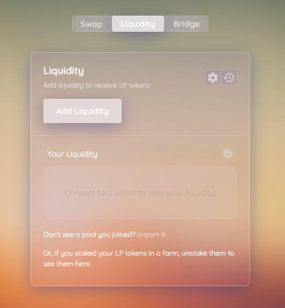

# Pools

\*\*\*\*[**MacaronSwap Magic Box** ](https://exchange.macaronswap.finance/#/pool)allow you to provide liquidity by adding your tokens to liquidity pools or “LPs”.

When you add your token to a liquidity pool \(LP\), you will receive LP tokens.

As an example, if you deposited $MCRN and $BNB into a liquidity pool, you would receive MCRN-BNB LP tokens.

The number of LP tokens you receive represents your portion of the MCRN-BNB liquidity pool. You can also redeem your funds at any time by removing your liquidity.

Providing liquidity is not without risk, as you may be exposed to impermanent loss.

[Article About IL](https://blog.bancor.network/beginners-guide-to-getting-rekt-by-impermanent-loss-7c9510cb2f22)

It’s not all bad for liquidity providers as you will also be given a reward in the form of trading fees. Whenever someone trades MacaronSwap, the trader pays a 0.2% fee, of which 0.17% is added to the liquidity pool of the swap pair they traded on.

For example:

- There are 10 LO tokens representing 10 MCRN and 10 BNB tokens.
- 1 LP token = 1 MCRN + 1 BNB
- Someone trades 10 MCRN for 10 BNB.
- Someone else trades 10 BNB for 10 MCRN.
- The MCRN/BNB liquidity pool now has 10.017 MCRN and 10.017 BNB.
- Each LP token is now worth 1.00017 MCRN + 1.00017 BNB.

To make being a liquidity provider even more worth your while, you can also put your LP tokens to work whipping up some fresh yield on the [MCRN farms \(here\)](https://macaronswap.finance/), while still earning your 0.17% trading fee reward.
