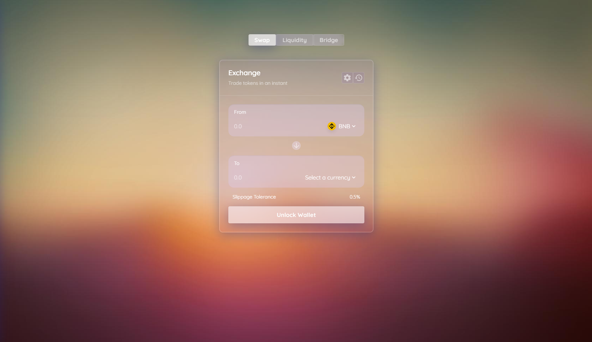
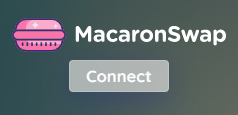
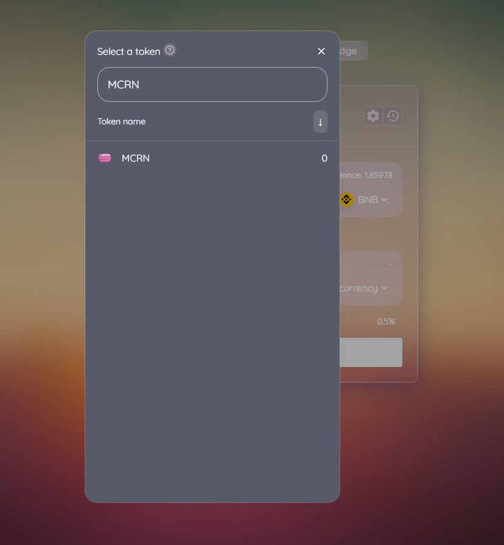
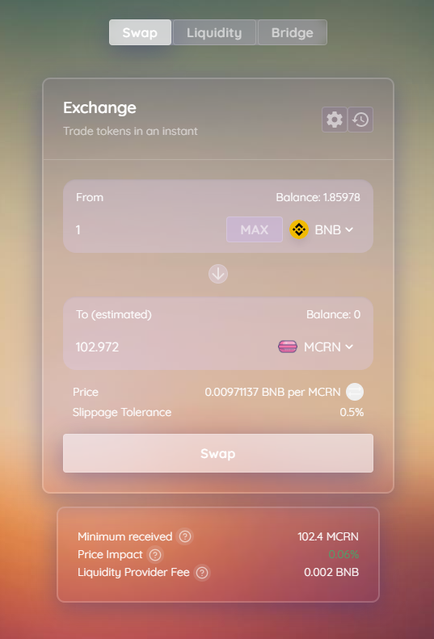
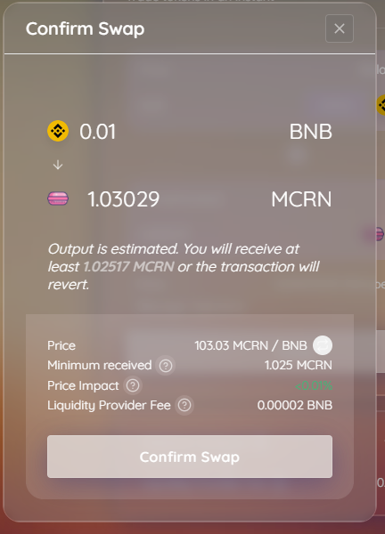
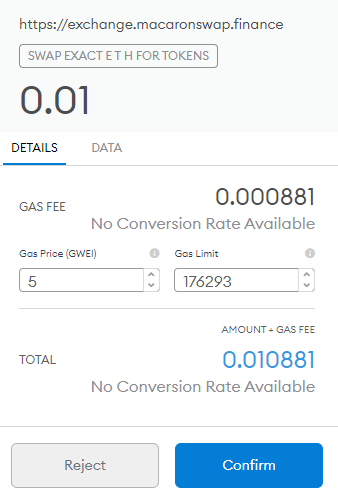

# How to Trade on the MacaronSwap Exchange

- Go to the exchange page [here](https://exchange.macaronswap.finance/#/swap).

- Unlock your Binance Smart Chain Wallet \(top left-hand side\).

- Select the tokens you wish to trade and enter the amount.

- Check the details, and click “Swap”.

- Check the details and click “Confirm Swap”.

- Confirm the transaction in your wallet.

- Done! You can click “View on bscscan” on the popup to see your transaction details.
